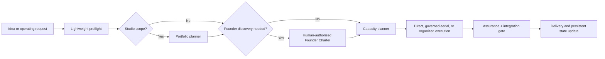

# Persistent AI Studio

[Website](https://fanfanfanfanfan626.github.io/orchestrate-agent-organization/) · [简体中文](README.zh-CN.md) · [AI installation guide](AI_INSTALL.md) · [Examples](EXAMPLES.md) · [Compatibility](COMPATIBILITY.md) · [Download v1.0.3 ZIP](dist/orchestrate-agent-organization-v1.0.3.zip) · [Contributing](CONTRIBUTING.md)

[](https://github.com/fanfanfanfanfan626/orchestrate-agent-organization/releases)
[](https://github.com/fanfanfanfanfan626/orchestrate-agent-organization/actions/workflows/validate.yml)

`orchestrate-agent-organization` is an agent skill for running a persistent, human-led AI studio. It helps an AI lead decide what to build, obtain human authorization for material product decisions, size a multi-agent organization from actual work, preserve product ownership across tasks, and integrate evidence before delivery.

It is designed for Codex and can be adapted to other agent hosts that support local skills, command execution, persistent files, and subagent lifecycle tools. Package compatibility and verified host behavior are separate; see [COMPATIBILITY.md](COMPATIBILITY.md).

## Why it exists

Most multi-agent prompts begin with an organization chart and end when the task ends. This skill starts with the work and keeps the important state alive:

- a Founder Office for clarifying new products and material changes;
- a persistent Studio Kernel for portfolio and product stewardship;
- deterministic portfolio and capacity planners in Python and PowerShell;
- bounded child-agent charters, permissions, leases, and write scopes;
- independent assurance and a lossless integration gate;
- lifecycle ownership from discovery through operation, maintenance, and retirement.



## Install in Codex

The installable skill is the nested directory [`skill/orchestrate-agent-organization`](skill/orchestrate-agent-organization). Repository documentation is intentionally kept outside the skill package.

### Windows PowerShell

```powershell
git clone https://github.com/fanfanfanfanfan626/orchestrate-agent-organization.git
$destination = Join-Path $env:USERPROFILE ".codex\skills\orchestrate-agent-organization"
New-Item -ItemType Directory -Force (Split-Path $destination) | Out-Null
Copy-Item ".\orchestrate-agent-organization\skill\orchestrate-agent-organization" $destination -Recurse
```

### macOS or Linux

```bash
git clone https://github.com/fanfanfanfanfan626/orchestrate-agent-organization.git
mkdir -p ~/.codex/skills
cp -R orchestrate-agent-organization/skill/orchestrate-agent-organization ~/.codex/skills/orchestrate-agent-organization
```

Restart Codex after installation, then invoke it explicitly:

```text
Use $orchestrate-agent-organization to turn this product idea into a human-governed, persistent AI studio and execute only the authorized horizon.
```

For installation by another AI agent, use [AI_INSTALL.md](AI_INSTALL.md).

The audited standalone package is [`dist/orchestrate-agent-organization-v1.0.3.zip`](dist/orchestrate-agent-organization-v1.0.3.zip). It includes the MIT license.

```text
SHA-256: 28426316988555CE60786AC2275BA484F74C29D285D563BD397F609EE3AA8423
```

Copy-paste product-horizon, portfolio-review, cross-project, and serial-fallback scenarios are in [EXAMPLES.md](EXAMPLES.md).

## Host requirements

The core governance and planning material is plain Markdown and JSON. Full operation expects:

- a host that can load `SKILL.md` and its relative references;
- local file access for studio state and decision artifacts;
- Python 3.10+ or PowerShell 7+ for deterministic planners and validators;
- subagent list, create, message, wait, interrupt, and reuse capabilities for organized execution;
- isolated workspaces or worktrees before granting concurrent write access.

If subagent tools are unavailable, the skill routes the same decision and assurance roles serially. Hosts use different tool names, so adapters may be needed outside Codex.

## Package contents

| Path | Purpose |
| --- | --- |
| `SKILL.md` | Routing, control hierarchy, and end-to-end operating workflow |
| `references/` | Constitution, governance, contracts, Founder Office, Studio Kernel, engineering, and integration rules |
| `scripts/plan_portfolio.*` | Validate studio state and recommend a bounded portfolio action |
| `scripts/plan_capacity.*` | Select the smallest useful execution topology from task and runtime evidence |
| `scripts/validate_charter.*` | Check delegated authority, budgets, depth, leases, isolation, and assurance bindings |
| `scripts/validate_integration.*` | Bind assurance evidence to a canonical delivery packet |
| `assets/` | JSON templates for studio state, assurance, attestations, and integration |
| `agents/openai.yaml` | Codex-facing display metadata and invocation prompt |

The Python runtime tools use only the standard library. PowerShell equivalents are included for Windows-first environments.

## Validate a checkout

```bash
python -m pip install -r requirements-dev.txt
python tools/validate_release.py
```

The validator checks the skill package shape, frontmatter, UI metadata, referenced files, JSON templates, Python syntax, script help entry points, and accidental local or generated files. GitHub Actions runs the same release audit and also parses every PowerShell script.

## Scope and limitations

- This is an operating system for agent work, not a guarantee of correct decisions or safe deployment.
- Human authorization remains mandatory for the material gates defined by the skill.
- Agent consensus is not evidence; deterministic tests and external reality evidence still matter.
- The capacity planner is a bounded coordination heuristic, not an ROI model.

## License

MIT. See [LICENSE](LICENSE).

Questions and contribution standards are documented in [SUPPORT.md](SUPPORT.md), [CONTRIBUTING.md](CONTRIBUTING.md), and [CODE_OF_CONDUCT.md](CODE_OF_CONDUCT.md). Report sensitive problems through [SECURITY.md](SECURITY.md), not a public Issue.

## Related projects

- [Idea Council](https://github.com/fanfanfanfanfan626/challenge-and-refine-ideas) clarifies and stress-tests an idea before consequential implementation.
- [Mastery Tutor](https://github.com/fanfanfanfanfan626/mastery-tutor) provides local-first mastery learning across compatible AI-agent hosts.
- [Skill Governor](https://github.com/fanfanfanfanfan626/skill-governor) audits and maintains overlapping Agent Skill libraries.
